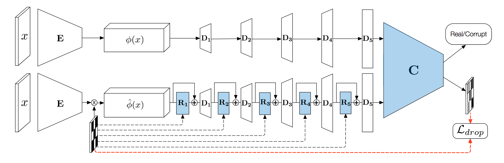
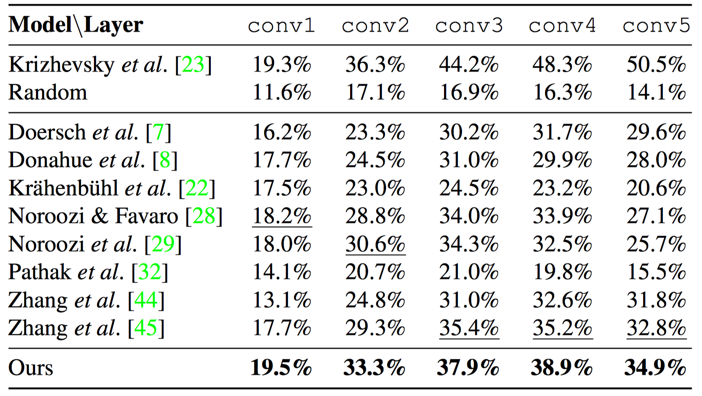

  <b style="font-size: 20px">Paper:</b> 
  <a href="https://?" style="font-size: 20px; text-decoration: none">[Arxiv]</a>

*A mixture of real images (green border) and images with synthetic artifacts (red border). Is a good object representation necessary to tell them apart?*

# Abstract

We introduce a novel self-supervised learning method based on adversarial training. Our objective is to train a discriminator network to distinguish real images from images with synthetic artifacts, and then to extract features from its intermediate layers that can be transferred to other data domains and tasks. To generate images with artifacts, we pre-train a high-capacity autoencoder and then we use a damage and repair strategy: First, we freeze the autoencoder and damage the output of the encoder by randomly dropping its entries. Second, we augment the decoder with a repair network, and train it in an adversarial manner against the discriminator. The repair network helps generate more realistic images by inpainting the dropped feature entries. To make the discriminator focus on the artifacts, we also make it predict what entries in the feature were dropped. We demonstrate experimentally that features learned by creating and spotting artifacts achieve state of the art performance in several benchmarks.

# Model & Code

*The proposed model. Two autoencoders {E, D 1 , D 2 , D 3 , D 4 , D 5 } output either real images (top row) or images with artifacts (bottom row). A discriminator C is trained to distinguish them. The corrupted images are generated by masking the encoded feature φ(x) and then by using a repair network {R 1 , R 2 , R 3 , R 4 , R 5 } distributed across the layers of the decoder. The discriminator and the repair network (both shaded in blue) are trained in an adversarial fashion on the real/corrupt classification loss.*

  <b style="font-size: 20px">Code:</b> 
  <a href="https://github.com/sjenni/LearningToSpotArtifacts" style="font-size: 20px; text-decoration: none">[GitHub]</a>

# Results

*Validation set accuracy on ImageNet with linear classifiers trained on the frozen convolutional layers after unsupervised pre-training.*
